# Руководство администратора
Свод: работы, расходы и отчёты · Версия от 12.09.2026

## Перед началом
Это инструкция для администратора, который ведёт учёт на основном сайте «Свод», проверяет записи и отправляет отчёты владельцам. Сотрудникам и владельцам предназначены отдельные краткие памятки.

Получите у ответственного за сервис адрес сайта, логин и пароль, ссылку на Telegram-бота и доступ к рабочей группе. Если браузер запросит логин и пароль, введите выданные данные. После входа должна открыться страница «Всё сходится.». Адрес рабочего сайта и имя бота в исходных данных не указаны: используйте ссылки, выданные вашей организацией.

Скриншоты сняты в Chrome на локальной демонстрационной копии текущего проекта. Имена получателей и Telegram ID демонстрационные, суммы показывают пример расчёта. Реальная отправка в Telegram при подготовке руководства не выполнялась. На вашем сайте набор организаций, сотрудников и тарифов может отличаться.

Порядок первого запуска: организации → команда → Telegram и получатели → услуги и тарифы → проверка записей → подготовка отчётов → подтверждение → проверка доставки.

**Быстрый поиск по руководству**

| Задача | Страницы PDF |
| --- | --- |
| Обзор и организации | 2-5 |
| Команда, Telegram и расписание | 6-9 |
| Услуги, тарифы и автоначисления | 10-17 |
| Журнал, ввод работ и история | 18-22 |
| Пересчёт и расходы | 23-25 |
| Подготовка, Excel и скидки | 26-29 |
| Исправления, отправка и новая версия | 30-33 |
| Telegram, удаление и закрытие месяца | 34-36 |
| Решение типовых проблем | 37 |

## 01. Обзор рабочего пространства
Откройте «Обзор». Выберите месяц и организацию. Карточки показывают сумму услуг и расходов, число записей, записи с замечаниями и пакеты на проверке.

«Последние записи» содержит только часть журнала. Для полной проверки нажмите «Весь журнал». Начисления команде показаны без расходов.

Кнопка «↻ Обновить» перечитывает данные сайта. Она не пересобирает Excel уже подготовленного пакета: для этого есть отдельная кнопка «Обновить» внутри «Счета».

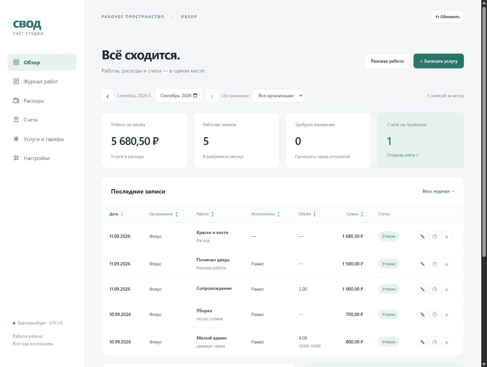

## 02. Организации
Путь: «Настройки» → «Организации». Для каждой организации доступны «Изменить» и «Получатели и счёт». Здесь же видно, включена ли ежемесячная подготовка именно для этой организации.

Для новой организации нажмите «+ Организация». Проверьте название до начала ввода работ: по нему и по алиасам бот определяет, куда отнести сообщение.

Отключённая организация сохраняет историю, но не используется для новых записей. Отключение не отменяет уже отправленные отчёты.

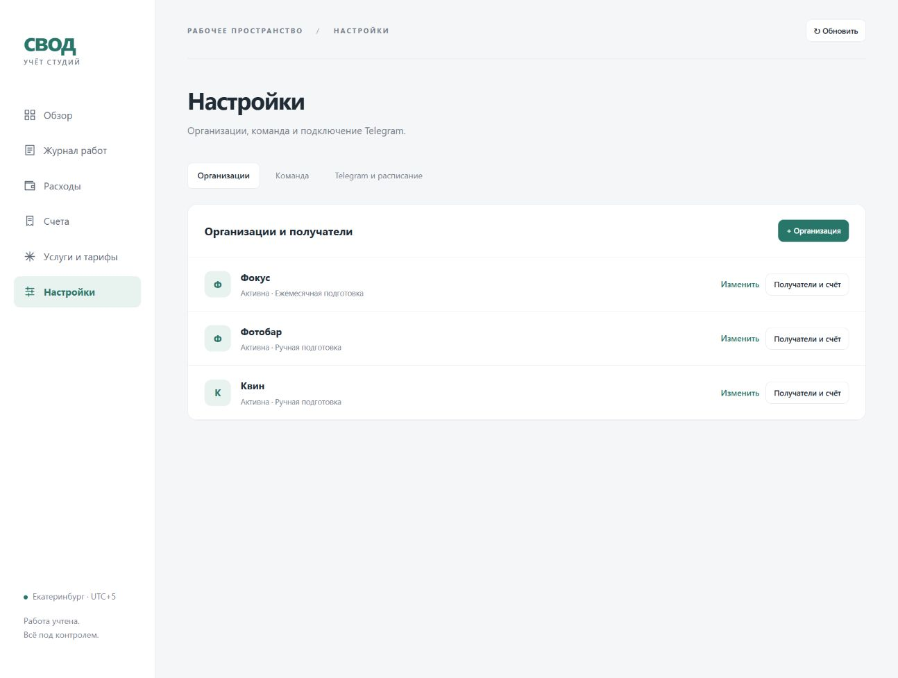

## 03. Карточка организации
Заполните «Название» и при необходимости «Алиасы через запятую». Алиасы — это допустимые короткие названия, которые сотрудники смогут использовать в сообщениях. Не задавайте одинаковые обозначения разным организациям.

«Лист старого отчёта» относится к прежнему формату экспорта. Листы новых счетов задаются в карточках услуг. Сохраните включённый флажок «Активна», если организация работает, затем нажмите «Сохранить».

После добавления проверьте тарифы новой организации: не считайте автоматически перенесённые значения согласованными расценками.

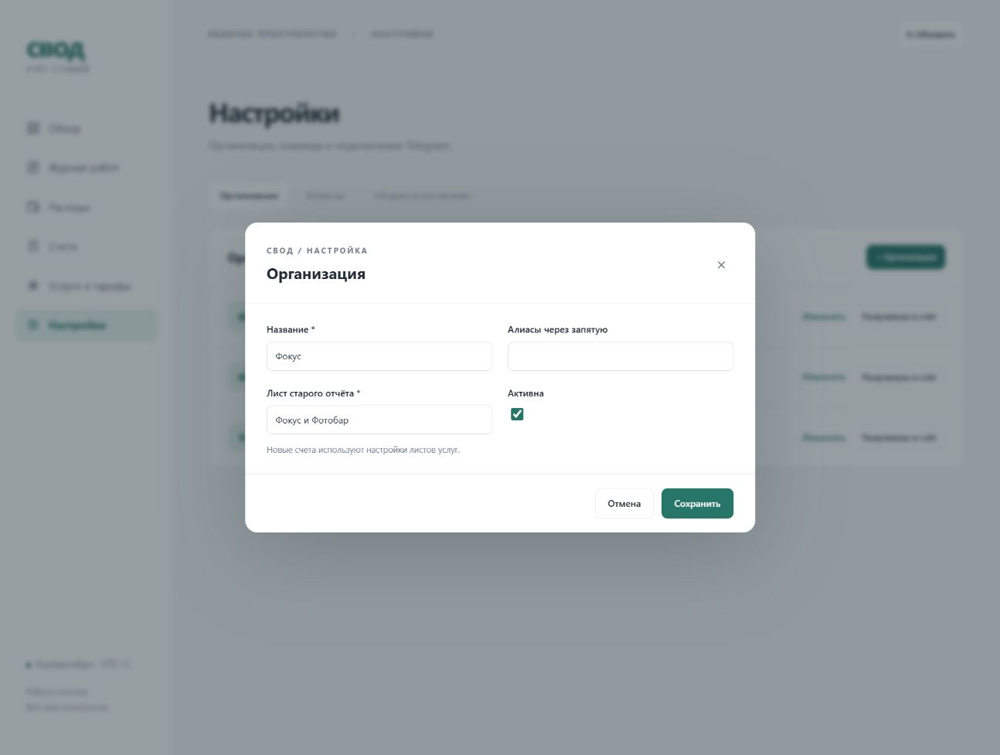

## 04. Получатели отчётов
Попросите владельца открыть бота в личном чате и отправить `/start`. Затем откройте «Настройки» → «Организации» → «Получатели и счёт» рядом с нужной организацией.

Выберите нужного человека в «Получатели Telegram». Для нескольких получателей удерживайте Ctrl при выборе в Windows. Проверьте имя и числовой ID: каждый выбранный человек получит полный Excel этой организации.

Флажок «Готовить счета ежемесячно» добавляет организацию в расписание. Для автоматической подготовки также требуется включить общее расписание, см. шаг 08. Нажмите «Сохранить». Если получатель добавлен после подготовки пакета, обновите сам пакет перед подтверждением.

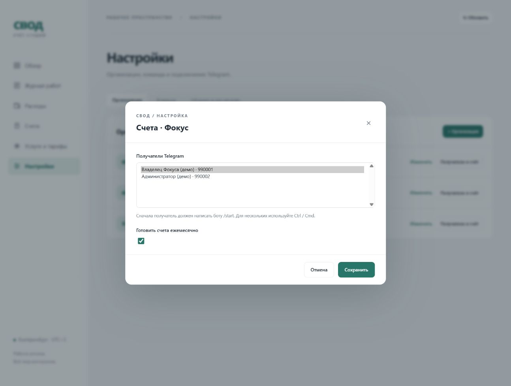

## 05. Команда
Путь: «Настройки» → «Команда». Добавьте сотрудника кнопкой «+ Сотрудник» или откройте существующего через «Изменить».

Сотрудник в команде и получатель Telegram — разные настройки. Сотрудник нужен для определения исполнителя работ; получатель нужен для доставки отчётов. Одного действия `/start` недостаточно, чтобы связать человека с карточкой сотрудника.

Перед первым рабочим сообщением проверьте, что сотрудник активен и привязан к правильному Telegram ID.

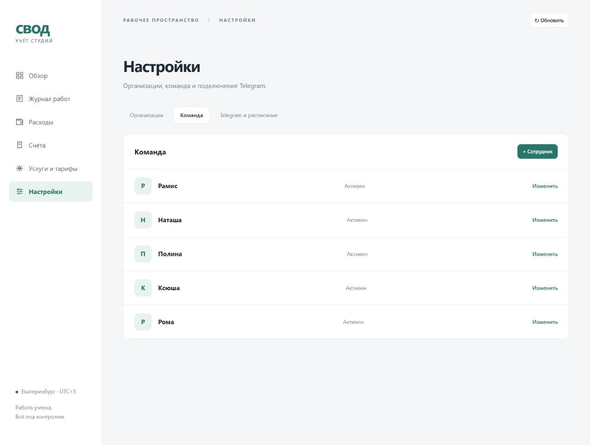

## 06. Карточка сотрудника
Заполните короткое имя; полное имя помогает различать однофамильцев и тёзок. Впишите Telegram ID, который сотрудник получил от бота после `/start`. При необходимости заполните username и алиасы имени.

Telegram ID — число пользователя, а не Chat ID рабочей группы. Избегайте одинаковых ID и неоднозначных алиасов у разных сотрудников: бот должен определить одного исполнителя.

Нажмите «Сохранить». Если сотрудник больше не работает, снимите «Активен». После изменения связи проверьте ранее ошибочно распознанные записи отдельно: исправление справочника само по себе не означает исправления старого исполнителя.

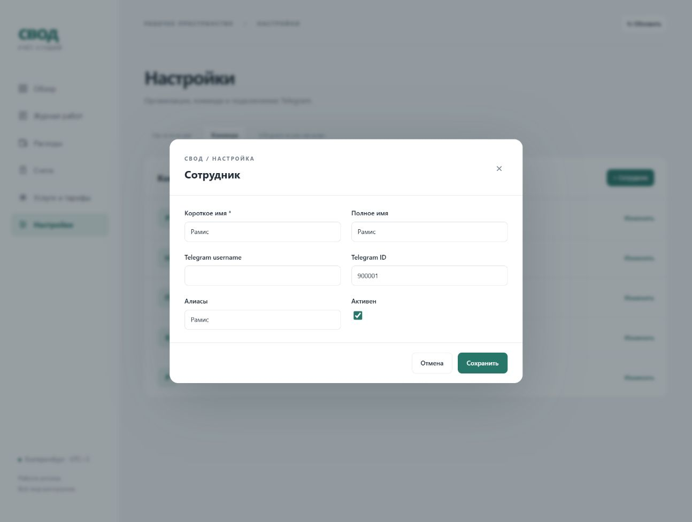

## 07. Telegram: проверить подключение
Путь: «Настройки» → «Telegram и расписание». В верхнем блоке показаны состояние подготовки, время, утверждающий и маршруты сообщений. Внизу — пользователи, написавшие боту `/start` в личном чате.

Если нужного человека нет в списке, попросите его запустить именно вашего бота и нажмите «↻ Обновить». В ответе бота должно быть «Вы подключены…» и Telegram ID.

Владелец получает счёт своей организации. Утверждающий получает все файлы пакета на проверку и кнопку отправки. Утверждающим может быть администратор сайта.

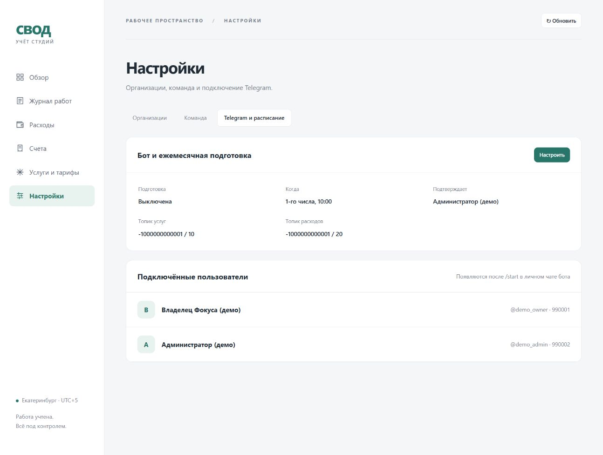

## 08. Настроить темы и расписание
Нажмите «Настроить». Выберите «Кто подтверждает отправку». Укажите день месяца от 1 до 28, час и минуту по Екатеринбургу. По умолчанию это 1-е число, 10:00; расписание готовит предыдущий календарный месяц.

Введите Chat ID и ID топика услуг, затем аналогичные значения для расходов. Получите эти ID у человека, подключившего бота. Пустой ID топика означает всю указанную группу. Услуги и расходы должны идти в разные маршруты: нельзя назначить одну и ту же тему обоим типам или перекрыть всю группу одним из маршрутов.

Включайте «Ежемесячная подготовка включена» после проверки первого пакета и получателей. Сохраните. Работа расписания и отправки требует запущенного серверного процесса; его проверяет ответственный за сервис. Расписание не заменяет подтверждение отправки владельцам.

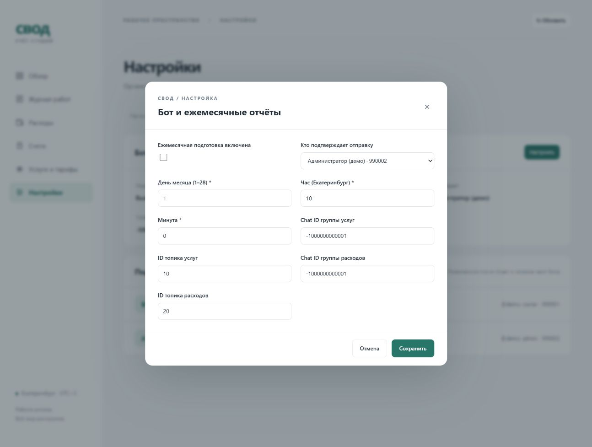

## 09. Справочник услуг
Путь: «Услуги и тарифы» → «Услуги». Здесь видны формат ввода, частота начисления, организация по умолчанию, лист Excel и активность каждой услуги.

Для изменения нажмите «Настроить» в строке услуги, для создания — «+ Добавить». Разовую работу не нужно добавлять в справочник: она записывается отдельно с описанием и готовой суммой.

После настройки выдайте сотрудникам точные названия и алиасы. Телефоны и другие автоматические услуги не следует параллельно записывать вручную.

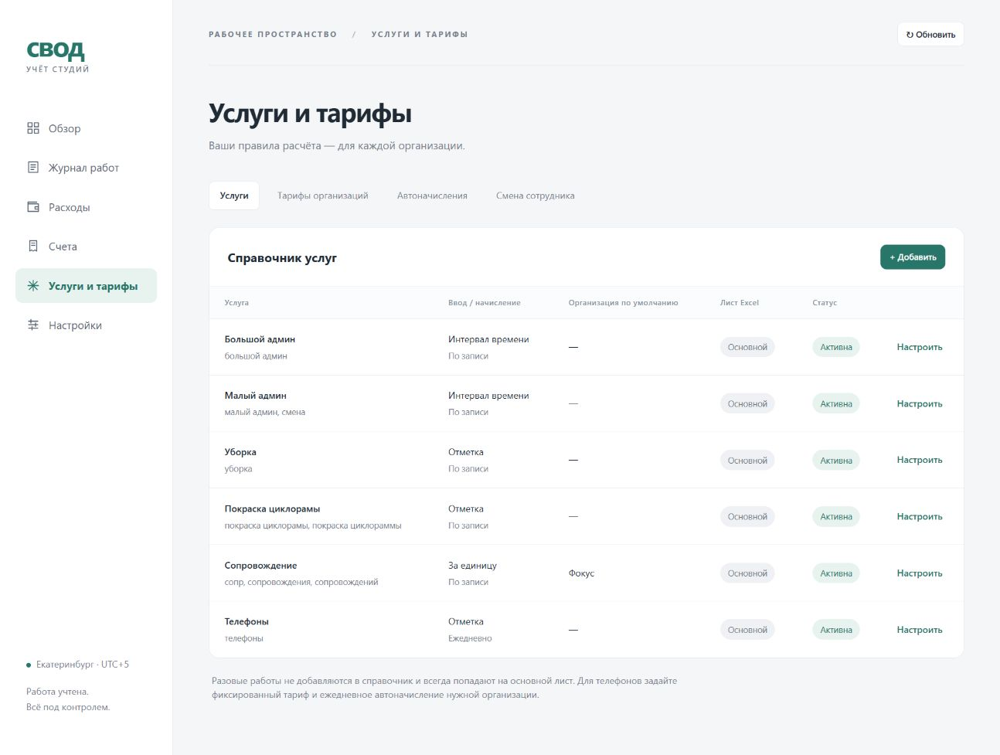

## 10. Настройки услуги
Укажите название и алиасы. В «Как бот читает запись» выберите интервал времени, количество, готовую сумму или отметку о выполнении. «Когда начислять»: по записи, ежедневно или ежемесячно.

«Организация по умолчанию» используется только когда сотрудник не указал организацию для этой части сообщения. В сообщении со знаком `+` организация предыдущей части не наследуется.

«Отдельный лист Excel»: пустое поле направляет услугу на «Основной». Одинаковое название листа объединяет на нём несколько услуг одного отчёта. Не используйте зарезервированные названия «Основной» и «Расходы» как отдельный лист. «Порядок» влияет на порядок услуг. Сохраните настройки и проверьте соответствие тарифов выбранному формату ввода.

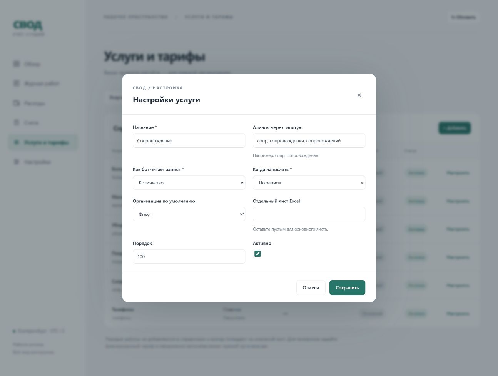

## 11. Тарифы организаций
Откройте вкладку «Тарифы организаций». Сверьте для каждой пары «услуга — организация» способ расчёта, ставку, пределы и период действия. Через «Фильтры» можно найти тариф по организации, названию услуги или алиасу.

Кнопка «+ Добавить» создаёт тариф; «Изменить» открывает существующий. Тариф должен покрывать дату работы. Периоды активных тарифов одной услуги и организации не должны пересекаться.

При смене цены закройте старый период предыдущим днём и создайте новый тариф с нужной даты. Изменение тарифа само по себе не пересчитывает уже сохранённые суммы: для них используется проверяемый пересчёт, шаг 22.

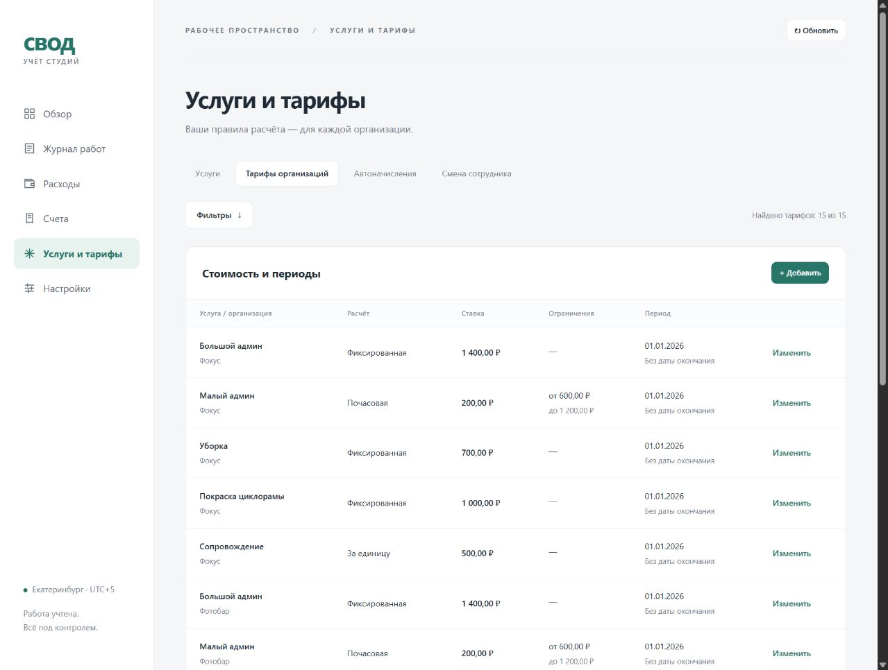

## 12. Как задать расчёт
В форме выберите услугу и организацию, затем способ расчёта. «Фиксированная» — ставка за запись; «Почасовая» — часы × ставка; «За единицу» — количество × ставка; «Готовая сумма» — стоимость из записи. Укажите ставку, даты, при необходимости минимум и максимум.

Сейчас почасовые записи рассчитываются отдельно. Например, при 300 ₽/ч, минимуме 600 ₽ и максимуме 1500 ₽ записи на 4 и 2 часа дадут 1200 ₽ и 600 ₽. Ранее объединённые записи пересчитываются автоматически при обновлении проекта. Утверждённые Excel-счета сохраняют прежние суммы; для нового счёта подготовьте новую версию.

Добавление, изменение или удаление часов одной записи не меняет суммы других участников. Возможность общего расчёта сохранена в проекте и может быть включена администратором сервера.

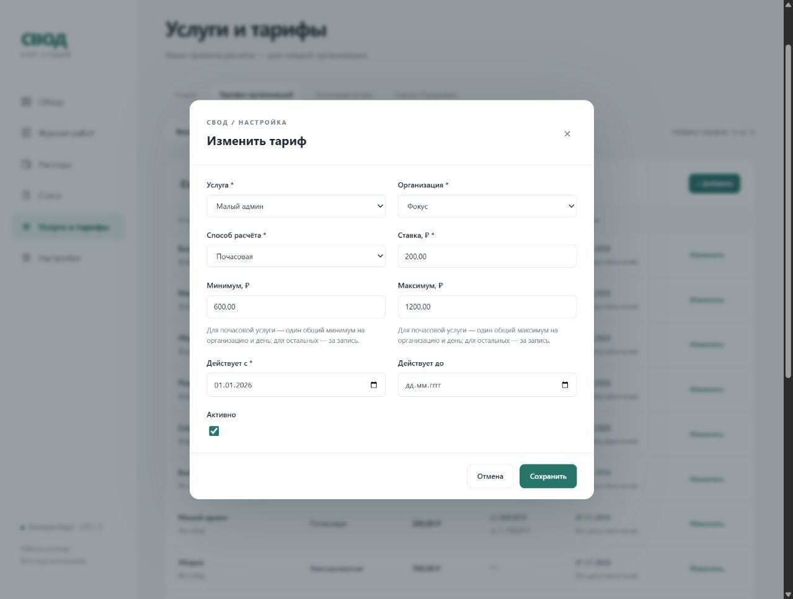

## 13. Автоначисления
Путь: «Услуги и тарифы» → «Автоначисления». Эта вкладка связывает регулярную услугу с организацией и периодом. Само наличие услуги «Ежедневно» ещё не задаёт, какой организации её начислять.

Откройте автоначисление кнопкой «Изменить» или создайте новое через «+ Добавить». В поле «Сотрудник» выберите исполнителя вместе с услугой, организацией и периодом. Новые записи этого автоначисления получат выбранного сотрудника и попадут в его заработок в главном отчёте. У одной услуги в разных организациях можно назначить разных сотрудников.

Пустое поле оставляет новые начисления без исполнителя. Смена сотрудника не изменяет уже созданные записи; старые начисления исправляются отдельно в журнале. Если выбранного сотрудника позднее отключили, новые записи будут помечены для проверки до исправления настройки и записей.

Сначала настройте частоту услуги и её тариф, затем создайте автоначисление. Для телефонов используется фиксированный дневной тариф. Ежедневные записи создаются по дням действия настройки; ежемесячные — по правилам регулярного начисления сервиса.

Перед отправкой отчёта проверьте фактически созданные записи через фильтр «Источник» → «Автоначисление». Они также входят в счёт. При выключении настройки уже созданные записи не исчезают автоматически.

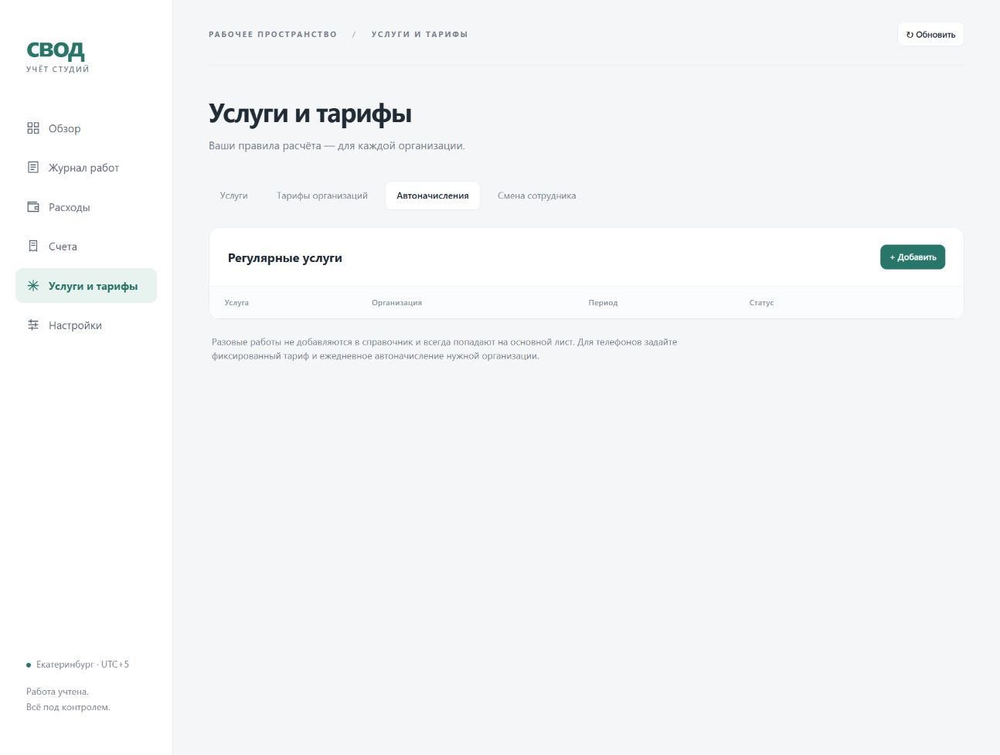

## 14. Форма автоматического начисления
Нажмите «+ Добавить». Выберите регулярную услугу, организацию и дату начала. Если известна дата окончания, укажите её. Проверьте флажок «Активно» и сохраните.

Если услуга не предлагается, проверьте её активность и «Когда начислять»: для этой формы нужна ежедневная или ежемесячная услуга. На весь выбранный период должен быть настроен соответствующий тариф.

Подготовка и обновление отчётов также запускают создание положенных автоматических записей до конца выбранного периода. Поэтому итог после обновления может измениться — скачайте Excel заново.

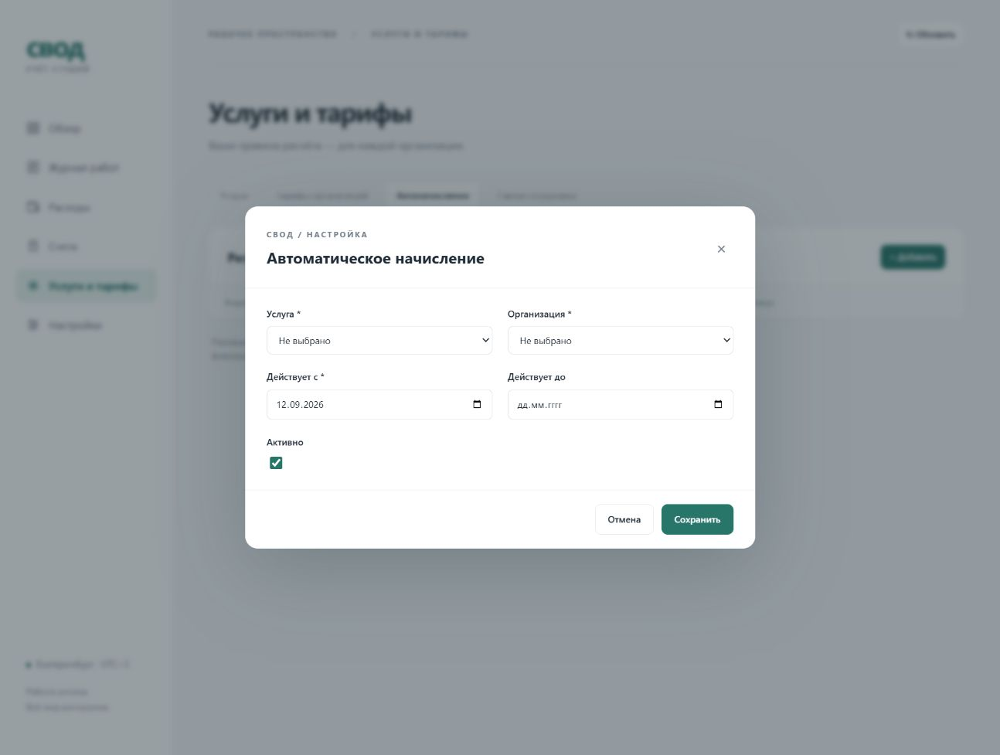

## 15. Смена сотрудника
Откройте вкладку «Смена сотрудника». Эта настройка определяет услугу для сообщения, содержащего интервал времени без названия услуги, например `12.09 10:00-14:00 Фокус`.

Нажмите «+ Добавить», чтобы связать сотрудника с его обычным типом смены. Для существующей связи используется «Изменить». Проверьте настройки до выдачи сотрудникам короткого формата сообщения.

Явно указанная услуга в сообщении помогает выбрать другой тип работы. В любом случае сверьте ответ бота: он должен показать ожидаемую услугу и исполнителя.

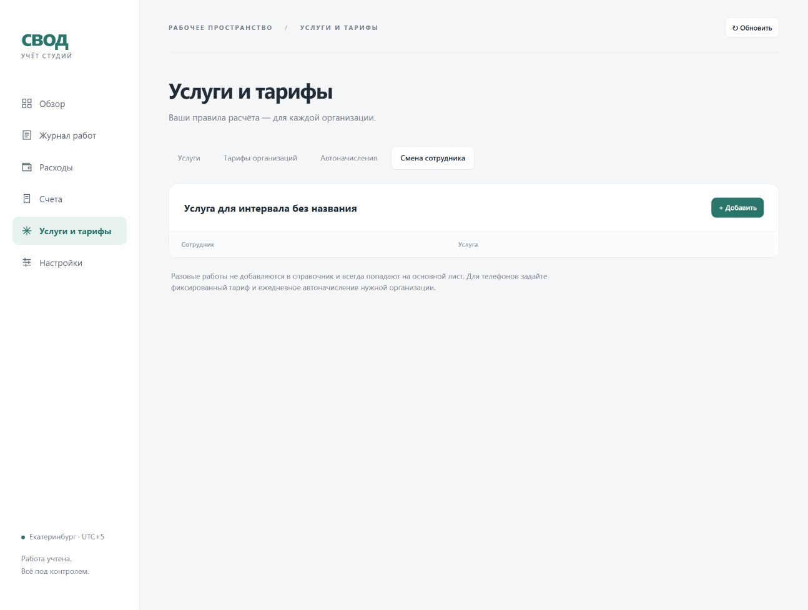

## 16. Выбор обычной смены
Выберите сотрудника и услугу по умолчанию, затем нажмите «Сохранить». Используйте услугу с интервалом времени и начислением «По записи», например «Малый админ» или «Большой админ».

Хотя список может показывать другие услуги, уборка, сопровождение и автоматические начисления не подходят для настройки временного интервала.

Если бот выбирает неправильный тип смены, сначала проверьте Telegram ID сотрудника, затем эту настройку и тариф выбранной услуги для организации.

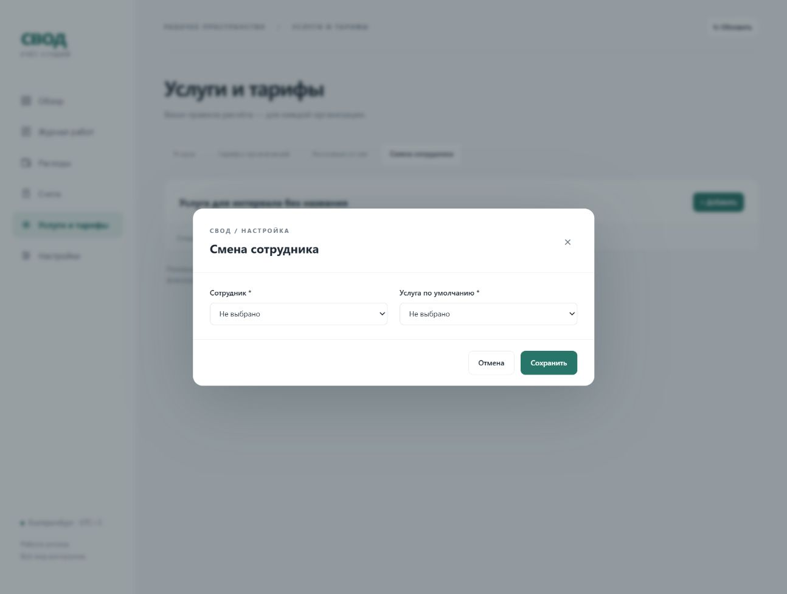

## 17. Ежедневная проверка журнала
Откройте «Журнал работ» и выберите месяц. Журнал содержит типовые услуги и разовые работы; покупки смотрите в «Расходы».

Сверяйте дату, организацию, услугу или описание, исполнителя, часы или количество, сумму и статус. «Проверить» означает замечание к записи, «Учтено» — отсутствие такой отметки; это не подтверждение оплаты и не статус доставки отчёта.

Справа у каждой строки: карандаш — изменение, часы — история, крестик — удаление. Наведите курсор для подсказки. Внизу — переход между страницами по 50 записей и итог по найденным строкам. После сообщения бота запись должна появиться при обновлении сайта.

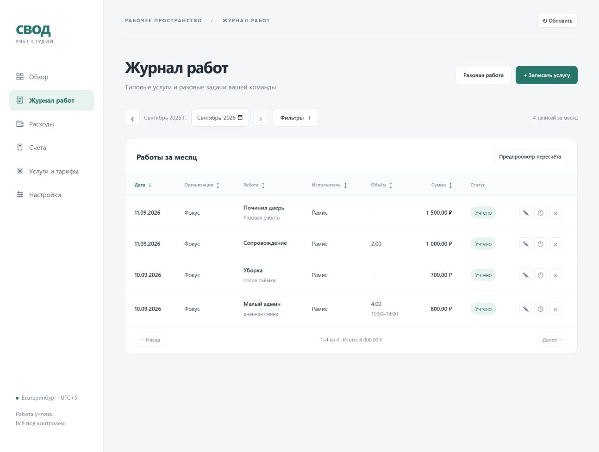

## 18. Поиск и фильтры
Нажмите «Фильтры». Доступны поиск по месяцу, организация, сотрудник, услуга, вид работы, статус, источник и сортировка. Для проверки проблем выберите «Статус» → «Нужно проверить».

Фильтры применяются ко всему выбранному месяцу, а не только к видимой странице. Сортировать можно списком или кнопками в заголовках колонок. Если запись не находится, проверьте месяц и нажмите «Сбросить фильтры».

Фильтры журнала не ограничивают состав счёта: в новый счёт входят все неудалённые записи выбранных организаций за период. Пометка `[ТЕСТ]` и источник «Тестовые данные» также не исключают запись автоматически.

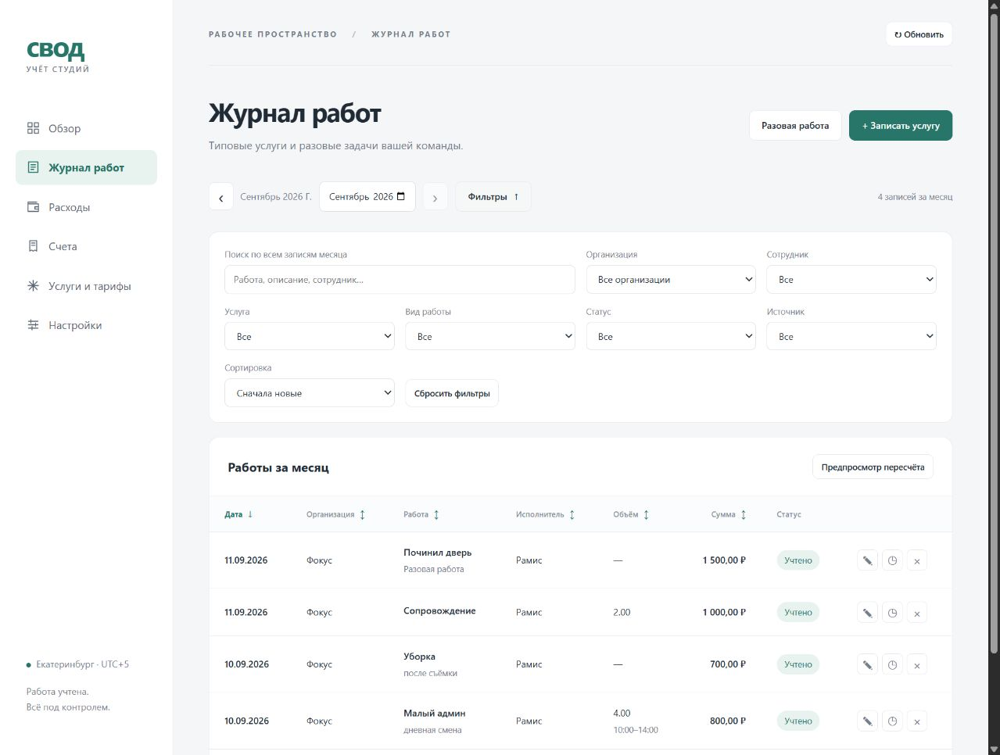

## 19. Записать типовую услугу на сайте
Нажмите «+ Записать услугу». Укажите дату, организацию, исполнителя и услугу. Для смены задайте начало и конец: часы вычисляются из интервала. Для количественной услуги заполните «Часы / количество». Для отметки о выполнении оставьте единицу. Комментарий необязателен.

Для услуги с готовой суммой заполните стоимость. В текущей проверенной версии есть ошибка: пустое поле «Сумма для ввода готовой стоимости» может вызывать «Некорректная сумма» даже у расчётной услуги. Для расчёта по тарифу допустим временный ввод `0` в это поле; обязательно проверьте рассчитанный итог после сохранения. Это ограничение версии, а не правило тарификации.

Нажмите «Сохранить» один раз и убедитесь, что строка появилась. Если произошла ошибка обновления, сначала проверьте журнал, прежде чем сохранять повторно.

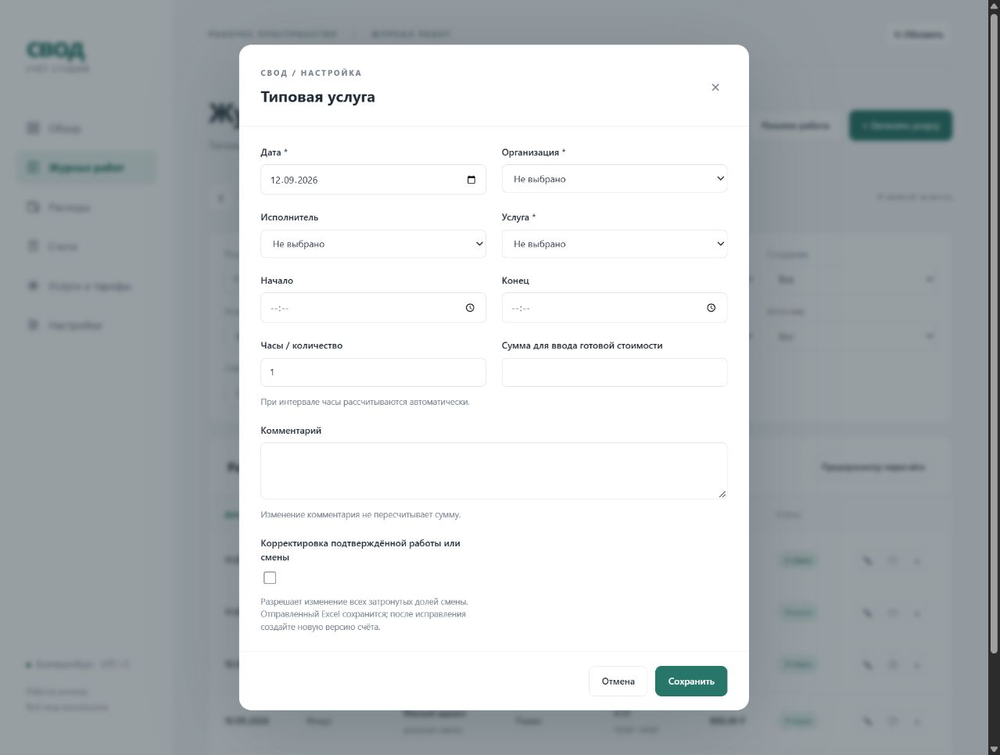

## 20. Разовая работа
Нажмите «Разовая работа». Укажите дату, организацию, исполнителя, готовую сумму и описание того, что сделано. Нажмите «Сохранить» и проверьте строку журнала.

Разовая работа не создаёт новый вид услуги, не требует отдельного тарифа и попадает на лист «Основной». Для записи от имени другого человека выберите именно исполнителя работы.

В Telegram можно написать без запятых: `Починил дверь 1500 Фокус`. Дата и другой сотрудник из справочника указываются в начале: `Рамис 12.09 Починил дверь 1500 Фокус`. Без даты используется дата сообщения. Старый формат с запятыми сохранён.

Если исполнитель не выбран, работа может потребовать проверки. Перед подготовкой отчёта откройте её карандашом и назначьте правильного сотрудника.

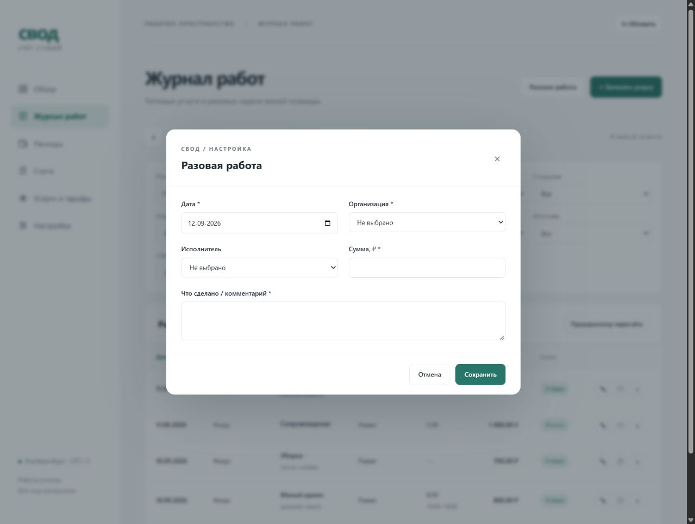

## 21. История изменений
Нажмите значок часов рядом с записью. Окно показывает события с датой и временем по Екатеринбургу, автором изменения и значениями «Было» / «Стало». Последние изменения расположены сверху.

Используйте историю для проверки суммы, исполнителя, исходного сообщения и причины расхождения с прежним отчётом. Для длинной записи прокрутите содержимое окна. Закройте крестиком «Закрыть историю».

Прежняя настройка включения в счёт может отображаться в истории, но новые счета используют все неудалённые записи. Выполняйте рабочие исправления через основной сайт «Свод»: техническая админка Django не заменяет этот процесс.

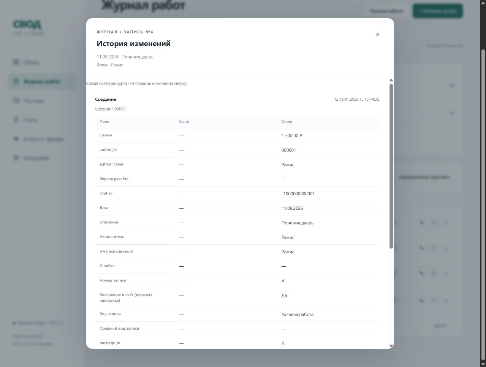

## 22. Пересчитать суммы после изменения тарифов
В «Журнал работ» выберите месяц и нажмите «Предпросмотр пересчёта». Результат появляется ниже журнала: прокрутите страницу вниз. Сверьте группы, участников, часы, суммы «Было» и «Стало», ошибки и пропущенные записи.

В текущем интерфейсе пересчёт использует выбранный период; фильтры организации и поиска не ограничивают его. Проверьте весь показанный список до применения.

Если всё верно и есть изменения, нажмите «Применить проверенный пересчёт». При сообщении об изменившихся данных заново откройте предпросмотр. Записи подтверждённых счетов пропускаются; на скриншоте показан именно такой случай. Для них используется явная корректировка и новая версия счёта. При нуле изменений кнопка применения недоступна.

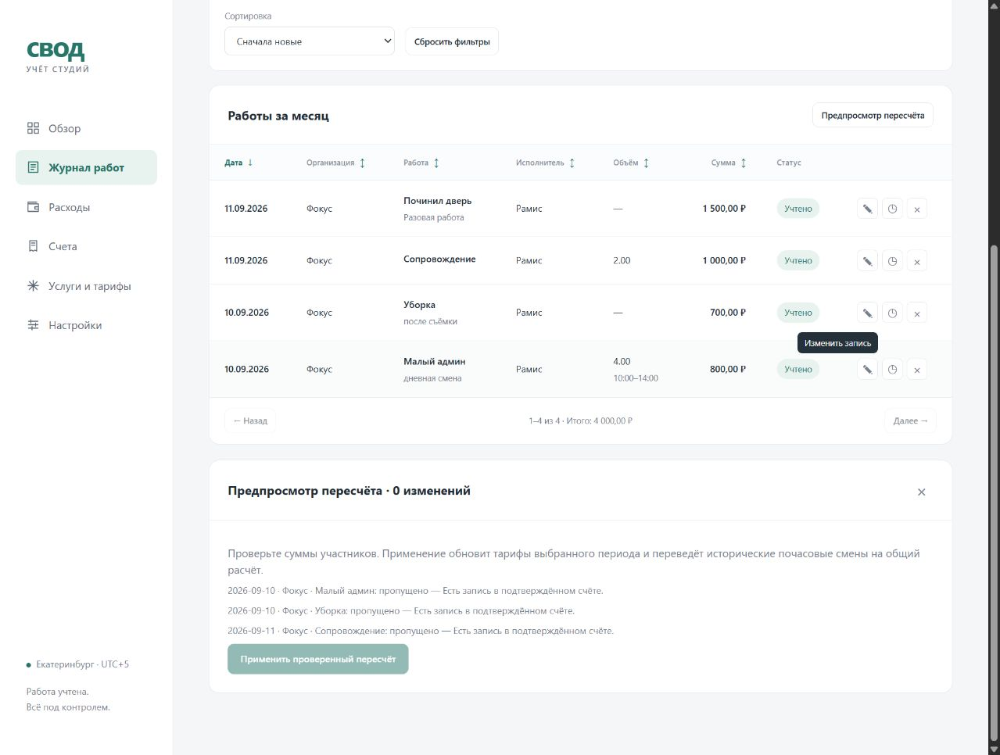

## 23. Проверка расходов
Откройте «Расходы». Выберите месяц, при необходимости раскройте фильтры. Сверьте назначение покупки, дату, организацию и сумму с первичными данными.

Расходы добавляются на сайте или приходят из отдельного маршрута Telegram. Проверьте, что покупка не записана дважды — вручную и сообщением сотрудника.

Для поиска доступны организация, статус, источник, текст и сортировка. Карандаш, история и удаление работают аналогично журналу. Расходы входят в новый счёт автоматически и отображаются в Excel на листе «Расходы».

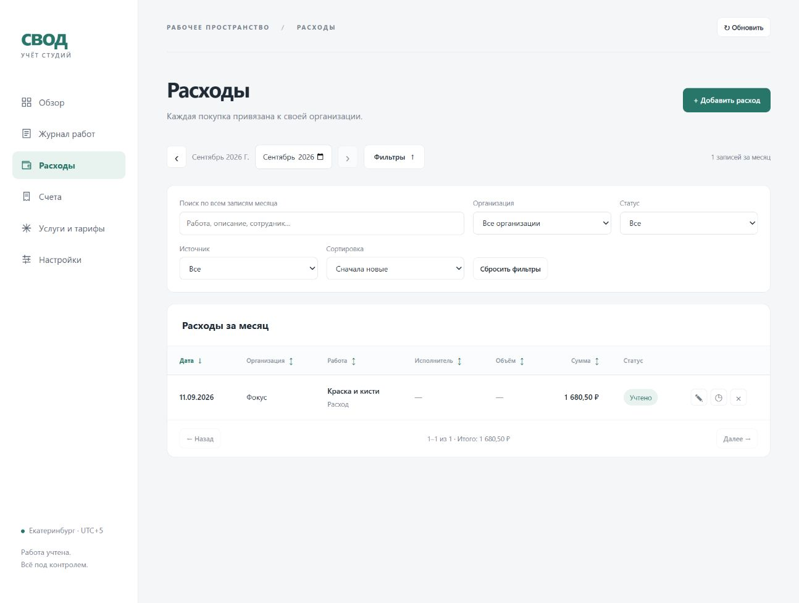

## 24. Добавить расход
Нажмите «+ Добавить расход». Заполните дату, организацию, сумму и «Назначение расхода». Поле исполнителя для расхода необязательно. Нажмите «Сохранить» и проверьте новую строку.

Для Telegram пример: `Краска и кисти 1500 Фокус`, с датой и копейками — `12.09 Краска и кисти 1500,50 Фокус`. Сообщение должно быть отправлено в тему расходов. Если дата не указана, используется дата сообщения по Екатеринбургу. Старые сообщения с запятыми также принимаются.

В назначении можно использовать запятые и обычный плюс. Организацию пишут последней. Если сообщение содержит ошибку, дождитесь исправления или внесите расход на сайте, проверив отсутствие дубля.

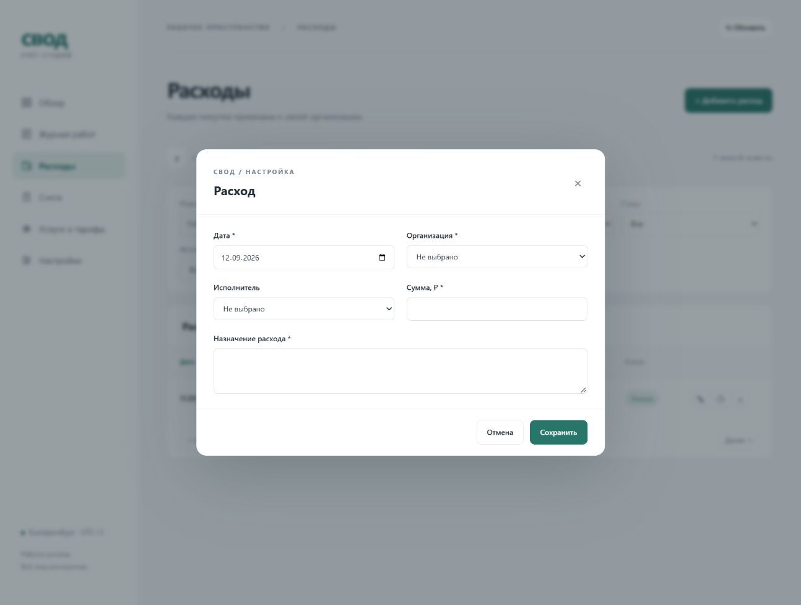

## 25. Счета и пакеты отчётов
Откройте «Счета». Слева находятся пакеты: период, номер, число организаций, версия пакета и статус. Выберите пакет, чтобы увидеть справа счета отдельных организаций.

Один пакет содержит несколько счетов, по одному для каждой выбранной организации. У каждого счёта есть собственный номер, версия, получатели, сумма и файл Excel. Проверяйте все организации пакета: подтверждение относится ко всему пакету.

«На проверке» — черновик, который можно обновлять. «Подтверждён» — зафиксированный пакет. Статус пакета не означает, что Telegram уже доставил файлы: это проверяется ниже в «Доставка».

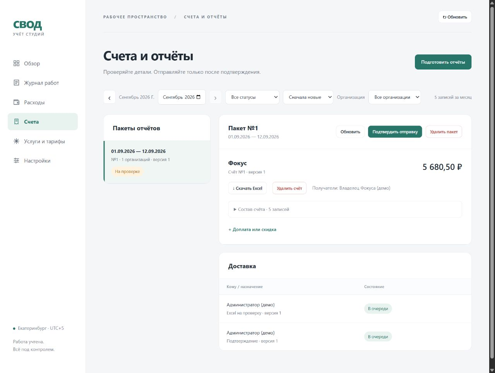

## 26. Подготовить отчёты за период
Нажмите «Подготовить отчёты». Проверьте начало и конец периода: по умолчанию это выбранный месяц, а для текущего месяца — период до сегодняшнего дня. Для месячного отчёта задайте весь завершившийся месяц.

Выберите нужные организации; для нескольких используйте Ctrl. Период не должен уходить в будущее или превышать допустимую длительность около года. Нажмите «Сохранить» и дождитесь нового пакета.

Подготовка создаёт Excel и, если назначен утверждающий, ставит ему файлы на проверку в очередь. Владельцам отчёты на этом этапе не отправляются. Если за пересекающийся период уже есть подтверждённый счёт, откройте его пакет и используйте «Новая версия».

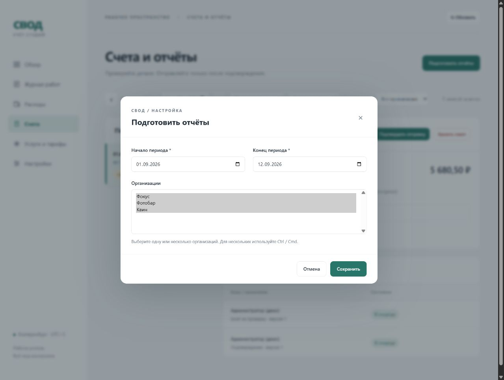

## 27. Проверить состав и Excel
В каждом счёте раскройте «Состав счёта». Сверьте строки, даты, исполнителей, суммы и листы. Прочитайте все замечания под получателями: неизвестный исполнитель, отсутствующий тариф или неназначенный получатель могут блокировать отправку.

Нажмите «↓ Скачать Excel» и откройте скачанный файл. На «Основной» проверьте организацию, период, номер, версию и общий итог. Проверьте разовые работы и услуги, затем отдельные листы услуг и «Расходы». Общий итог уже включает все листы и корректировки.

Если нужны исправления, внесите их в журнал или настройки. Вернитесь к пакету и нажмите его «Обновить», затем скачайте файл заново. Ручное изменение скачанного Excel не меняет файл, который отправит система.

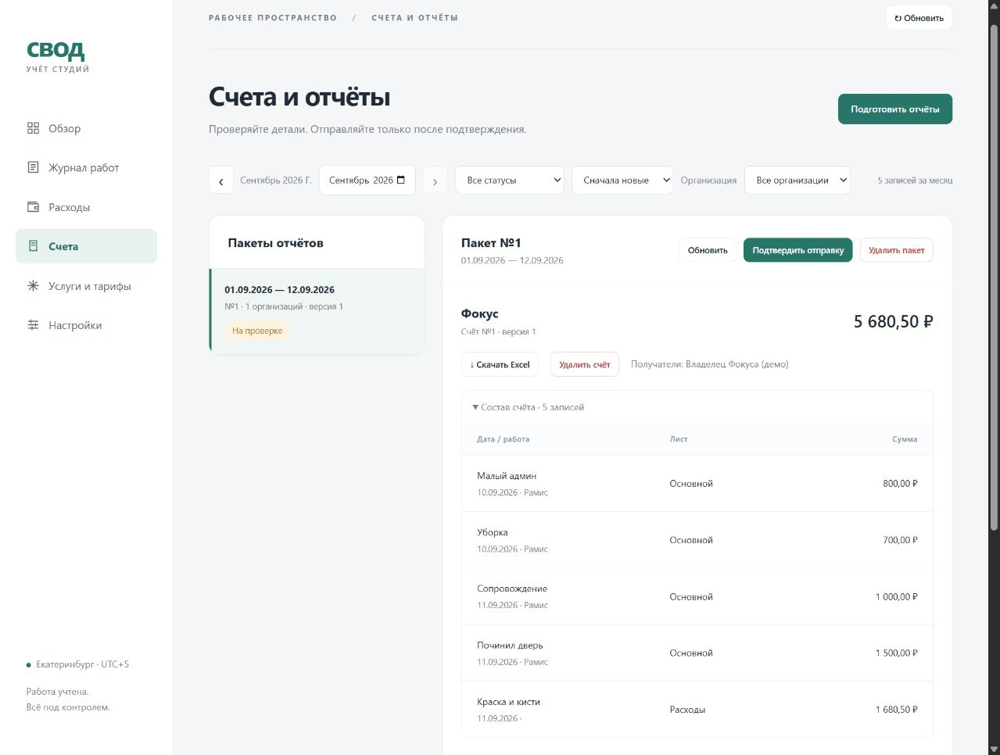

## 28. Доплата или скидка
В черновике нажмите «+ Доплата или скидка» под нужным счётом. Введите понятное пояснение и сумму: положительную для доплаты, отрицательную для скидки. Например, `-500` с пояснением «Согласованная скидка за сентябрь».

Нажмите «Сохранить». Проверьте итог и заново скачайте Excel. Общий итог не должен быть отрицательным. Корректировка относится только к выбранному счёту и не изменяет стоимость строк журнала.

Ошибочную корректировку в черновике можно убрать крестиком рядом с ней. Если пакет уже подтверждён, сначала создайте его новую версию; прежний отправленный файл остаётся неизменным.

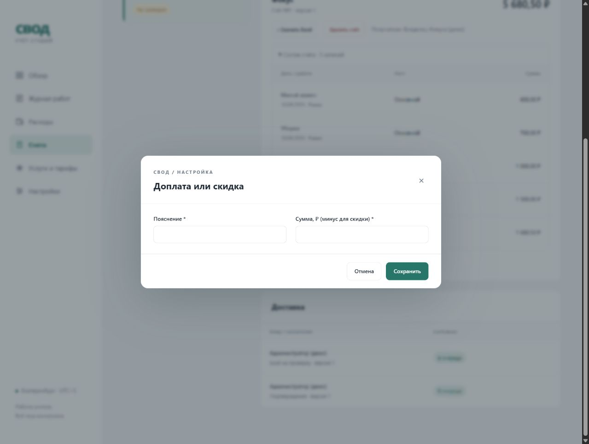

## 29. Исправить или удалить запись
Найдите запись в журнале или расходах и нажмите карандаш. Сверьте актуальные значения, внесите исправление и сохраните. Изменение только комментария не пересчитывает сумму. Не держите одновременно несколько открытых форм одной записи: старая форма может перезаписать более новые данные.

Если запись вошла в подтверждённый счёт, включите «Корректировка подтверждённой работы или смены». Для почасовой услуги это разрешает изменение всех затронутых долей общего дня. После исправления подготовьте новую версию счёта — старый Excel не обновляется.

Для удаления используйте крестик строки и внимательно прочитайте подтверждение. Удаление может перераспределить суммы остальных участников дня. Удаление исходного сообщения в Telegram не удаляет запись на сайте. Правка сообщения сотрудником заменяет все его части; ошибка в одной части отменяет всё изменение.

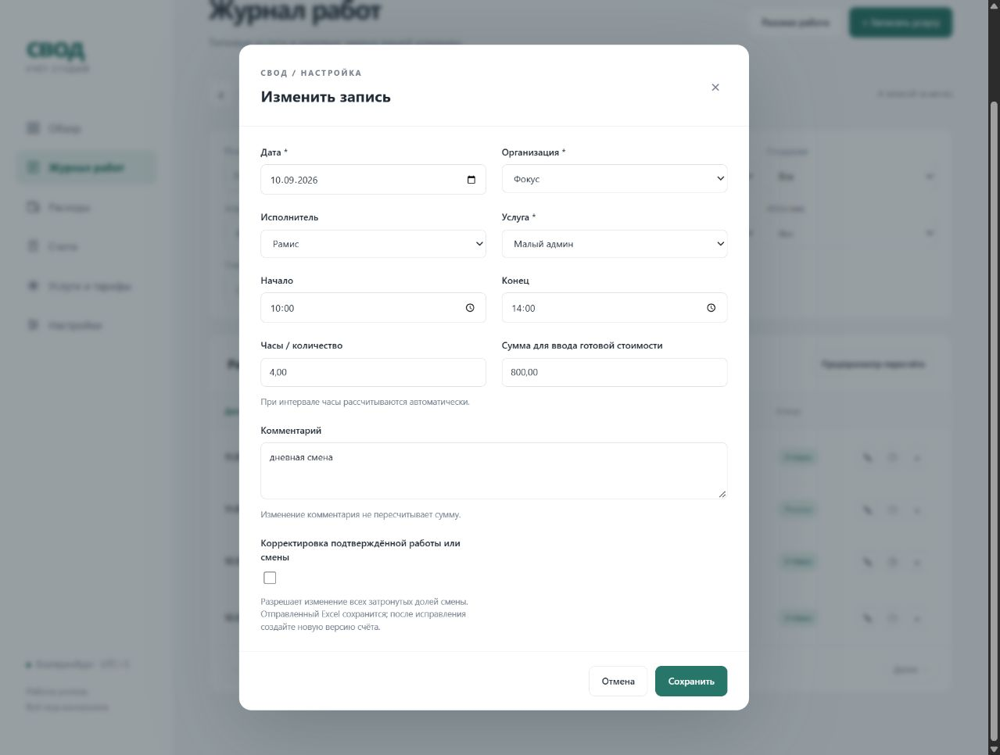

## 30. Подтвердить отправку владельцам
Перед отправкой проверьте период, все организации, получателей, суммы и последнюю версию каждого Excel. Убедитесь, что замечания устранены, тестовых записей и дублей нет.

В черновике нажмите «Подтвердить отправку». Сайт покажет окно с периодом, числом организаций, общей суммой и версией пакета. Подтвердите только после сверки. Если данные изменились с момента подготовки, система обновит файлы и попросит проверить их и подтвердить заново.

Успешный результат — статус «Подтверждён» и постановка счетов в очередь владельцам. На скриншоте показан этот этап в изолированном примере. Фактическая доставка ещё требует проверки. Подтверждённый пакет редактируют через «Новая версия».

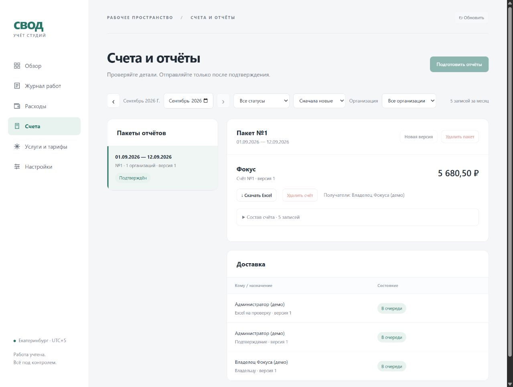

## 31. Проверить доставку
Внизу выбранного пакета найдите «Доставка». Сверяйте получателя, назначение и версию. «Excel на проверку» и «Подтверждение» относятся к утверждающему, «Владельцу» — к конечному получателю.

«В очереди» означает ожидание; «Отправляется» — текущую попытку; «Отправлено» — успешную передачу Telegram, но не прочтение человеком. «Ошибка» требует прочитать причину и устранить её перед «Повторить». Например, получатель должен запустить или разблокировать бота.

«Нужно проверить доставку» означает неопределённый результат: сначала проверьте личный чат получателя, потому что файл мог уже прийти. Только затем используйте «Повторить» и подтвердите риск дубля. «Отменено» может означать устаревшую очередь после обновления. Если очередь долго не движется, обратитесь к ответственному за сервис. В демопримере отправка отключена, поэтому показано ожидание.

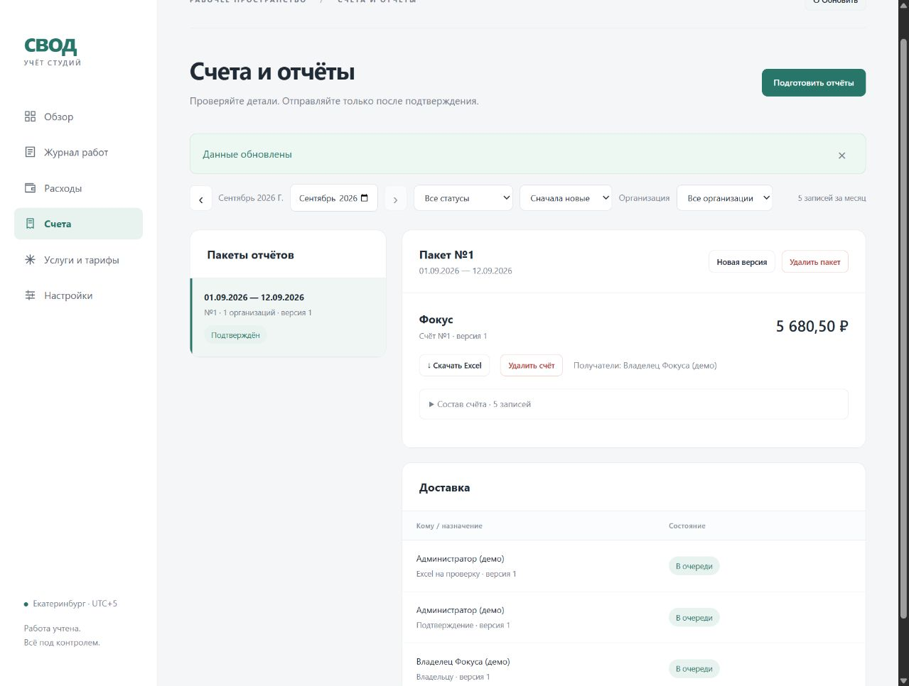

## 32. Новая версия после исправлений
Откройте подтверждённый пакет и нажмите «Новая версия». Создаётся новый пакет на проверке за тот же период и по тем же организациям. В карточке нового счёта появятся новая версия и пометка «заменяет №…».

Сверьте исправленные строки, перенесённые доплаты и скидки, получателей и итог. Скачайте новый Excel. Если после создания версии внесли ещё изменения, обновите новый пакет. Затем подтвердите его и проверьте доставку.

Обратите внимание: версия нового пакета может начинаться с 1, а версия заменяющего счёта — быть 2 или выше. Это разные счётчики. Владельцу передаётся номер и версия счёта. Старый файл остаётся в Telegram, поэтому используйте последнюю согласованную замену.

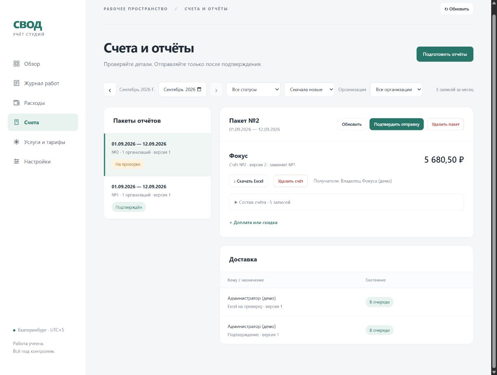

## Подтверждение через Telegram
Если вы назначены утверждающим и написали боту `/start`, подготовленный пакет поступает вам в личный чат. Сначала бот отправляет все Excel-файлы на проверку, затем сводку по организациям и кнопки «Подтвердить отправку» / «Обновить отчёты».

Откройте и проверьте каждый файл. При ошибке исправьте данные на сайте и обновите пакет. После обновления используйте последнюю сводку: кнопки прежней версии могут быть отклонены. Подтверждать в боте может только назначенный утверждающий; обычному владельцу эта роль автоматически не выдаётся.

После нажатия «Подтвердить отправку» дождитесь ответа, что счета поставлены в очередь, затем проверьте «Доставка» на сайте. Если данные изменились, повторно проверьте обновлённые файлы и подтвердите их. Нулевой счёт владельцу автоматически не отправляется.

Этот раздел описывает работу по текущей реализации бота. Скриншоты реального личного чата не снимались, поскольку рабочий бот и доступ к Telegram не предоставлены.

## Удаление счетов и пакетов
Кнопка «Удалить счёт» удаляет выбранный счёт и его файл с сайта. «Удалить пакет» удаляет пакет со всеми его счетами. Исходные работы и расходы остаются. Уже доставленный Excel остаётся в Telegram.

Это не способ исправить данные или отменить отправленное сообщение. Для исправлений используйте корректировку и «Новая версия». Перед удалением сохраните нужные файлы и проверьте номер объекта. Не рассчитывайте на корзину или автоматическое восстановление.

Если сайт запрещает удаление из-за текущей или неопределённой доставки либо связанных версий, сначала разберитесь с состоянием и зависимостями. Не удаляйте технические записи напрямую в базе или Django Admin.

## Закрытие месяца: контрольный список
1. Выберите завершившийся месяц и проверьте работы и расходы каждой организации.
2. Разберите все записи «Проверить», неизвестных исполнителей, отсутствующие тарифы, дубли и тестовые данные.
3. Сверьте автоматические начисления и общие почасовые дни. При согласованном изменении тарифов выполните предпросмотр пересчёта.
4. Проверьте Telegram-получателей и утверждающего; все должны предварительно написать боту `/start`.
5. Подготовьте пакет за правильные даты и организации. Если черновик уже есть, обновите его.
6. Проверьте состав каждого счёта, скачайте и просмотрите Excel, внесите согласованные доплаты и скидки.
7. Подтвердите последнюю проверенную версию и дождитесь «Отправлено» у доставок владельцам.
8. При исправлении после подтверждения используйте явную корректировку и новую версию. Сохраните номер и версию итогового счёта.

## Главный отчёт по заработку

Откройте «Главный отчёт» в меню и выберите месяц. Таблица показывает общую начисленную сумму каждого сотрудника по всем организациям, включая отключённые. Для текущего месяца учитываются записи по сегодняшний день. Это начисления по журналу, а не подтверждение фактической выплаты зарплаты.

Расходы, доплаты и скидки в счетах не входят в заработок. Работы без назначенного сотрудника, с отметкой проверки или ошибкой расчёта находятся в блоке «На проверку». Автоматические начисления без исполнителя показаны отдельно в «Начисления без сотрудника». Суммы обоих блоков исключены из заработка: исправьте записи в журнале и обновите отчёт.

«Скачать Excel» выгружает текущие данные выбранного месяца на листы «Заработок» и «На проверку». Просмотр и скачивание не пересчитывают тарифы и не меняют начисления.

Бот автоматически отправляет общий Excel 1-го числа в 10:00 по Екатеринбургу за предыдущий месяц человеку из настройки «Кто подтверждает отправку». Получатель должен предварительно написать боту `/start`. Переключатель «Отправлять главный отчёт 1-го числа в 10:00» находится в настройках Telegram и включён по умолчанию. Эта отправка не зависит от подтверждения счетов или включения месячных счетов организаций.

Состояние отправки за выбранный месяц отображается на странице отчёта. При ошибке доступна кнопка «Повторить отправку». Если результат неизвестен, сначала проверьте личный чат получателя: повтор может доставить второй экземпляр. При смене утверждающего повтор направляется новому получателю. Выключение рассылки приостанавливает ожидающие отправки.

Автоотправка хранит снимок на момент подготовки. Изменения журнала после подготовки видны на сайте и в новом скачивании Excel; повторная отправка доставляет сохранённый снимок. Если сервис не работал в назначенное время, после запуска он подготовит отчёт за предыдущий месяц; старые месяцы можно скачать вручную.

## Если что-то пошло не так
| Ситуация | Действие |
| --- | --- |
| Бот молчит | Проверьте рабочую группу и тему. В личном чате работы не учитываются. Проверьте журнал: запись могла сохраниться, а ответ Telegram — не дойти. Если маршрут верный, сообщите ответственному за бота. |
| «Не удалось сохранить» | Прочитайте причину, исправьте исходное сообщение. Не считайте запись принятой до «Записано» или «Записи обновлены». |
| Исполнитель неизвестен | Проверьте ID и алиасы в «Команда», затем назначьте исполнителя в самой записи. |
| Организация не найдена | Проверьте название, алиасы и активность; указывайте организацию для каждой услуги в сообщении. |
| Нет тарифа / периоды пересекаются | Проверьте услугу, организацию и даты действия. Устраните разрывы или пересечения. |
| Новая услуга на сайте: «Некорректная сумма» | Для расчётной услуги см. временный обход в шаге 19; для готовой суммы введите согласованную стоимость. |
| После сохранения ошибка, форма не закрылась | Сначала обновите журнал и проверьте, сохранилась ли запись. Повторное создание может дать дубль. |
| Сумма участника изменилась | Проверьте часы, ставку, минимум и максимум именно этой записи. |
| Счёт не отправляется | Исправьте замечания, назначьте получателя и обновите пакет; затем подтвердите заново. |
| «Данные изменились» / старая кнопка | Откройте последнюю версию, заново скачайте файлы и подтвердите проверенный пакет. |
| Уже есть счёт за период | Используйте «Новая версия» в подтверждённом пакете. |
| Очередь стоит / ошибка Telegram | Проверьте запуск бота у получателя и причину доставки; работу сервера проверяет ответственный за сервис. |
| «Нужно проверить доставку» | Проверьте чат получателя перед повтором, чтобы не послать второй экземпляр. |

Инструкция основана на интерфейсе и текущем коде проекта. Она описывает работу пользователя сайта; техническое развёртывание и обслуживание сервера выполняются отдельно.
